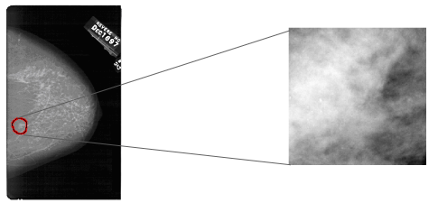

## Contents
{:.no_toc}
*  
{: toc}

## Literature review

**Transfer learning with DDSM**: We first identified which neural networks are currently being used for transfer learning in the context of cancer identification and classification [2],[3],[4]. In particular, while many available DCNN models for transfer learning were not specifically trained for biomedical applications, they appear to nonetheless achieve reasonably strong performance when applied to the DDSM dataset for differentiation among normal and abnormal cases, as well as classification of abnormal cases. 

Jain and Levy [3] compare the performance of multiple DCNN architectures on the DDSM dataset, and achieve 60.4% accuracy with a hand-built shallow CNN, 89.0% with AlexNet, and 92.9% with GoogleNet. Especially noteworthy is the fact that the GoogleNet's recall rate of 93.4% surpassed that of professional radiologists, who typically achieve recall rates that range from 74.5% to 92.3%. Shams et al. [5] perform simultaneous ROI-identification and classification using a model that combines CNNs and GANs, and achieve similar results of around 89% accuracy and 88.4% AOC on the DDSM. 

## Data Background

We chose to work with the USF Digital Database for Screening Mammography (DDSM), which, while widely used in the literature, requires extensive preprocessing to get to a form that can be used for even basic analysis. Given time constraints, we therefore drew on a prepared version of the dataset provided by [1] so that we could focus on the more interesting and valuable tasks of image classification and classifier interpretability. 

This version of the DDSM data differs from the original in a few ways:
- It combines the original DDSM with the CBIS-DDSM data set, which is "a subset of the DDSM data selected and curated by a trained mammographer"[2]. The CBIS-DDSM data set is cleaner and of higher resolution, but only has scans with abnormalities, so normal images were taken from the original DDSM data set and combined with this data set. That the cases with and without suspicious masses come from different data sets will have to be explicitly accounted for when training classifiers in order to ensure that the classifications are not simply made based on irrelevant features that identify the dataset (e.g. the distribution of pixel intensities), rather than the meaningful content in the image. If necessary, we may train only on abnormal observations with a growth identified, omitting the "normal" class altogether. In this case, our research question would focus on classifying growths as benign or malignant, conditional on there being a growth already identified. We have also considered the option of not omitting the "normal" observations, but instead explicitly accounting for dataset bias as in [5].
- The CBIS-DDSM images are published with associated regions of interest (ROI), identified using a pixel mask layer that varies across the images in size. The preprocessed dataset provided by [1] clips the images to the ROI using a buffer surrounding the pixel mask, though in a way that ensures the images are of uniform size. Similarly-sized tiles were also extracted from the "normal"-case images. Thus, all the images in the prepared dataset are 299 x 299 pixels.

- The CBIS-DDSM dataset contains 753 calcification cases and 891 mass cases, while the DDSM contains 695 normal cases. Given the small size of this dataset, offline data augmentation (specifically, rotations and flips) was performed to generate an enlarged sample size. However, we are concerned by the fact that it appears that augmented data were included in the test set.

The dataset is already divided into training, cross-validation, and test sets, containing 55885, 7682, and 7682 observations, respectively, though we have concatenated the cross-validation and test sets below. 

The observations are labelled as follows:
* 0: negative/normal (no suspicious masses at the time of the initial screening nor at the subsequence screening four years later) 
* 1: benign calcification
* 2: benign mass (a suspicious mass was found that was subsequently determined to be non-malignant)
* 3: malignant calcification
* 4: malignant mass

Whereas the observations of class 0 originate from the DDSM, those of classes 1-4 come from the CBIS-DDSM.

## References

[1] Eric A. Scuccimarra, DDSM dataset, Version 10. Accessed at https://github.com/escuccim/mias-mammography

[2]  Scuccimarra, Eric A. “ConvNets for Detecting Abnormalities in DDSM Mammograms.” Medium, 21 May 2018, medium.com/@ericscuccimarra/convnets-for-classifying-ddsm-mammograms-1739e0fe8028.

[3] Arzav Jain, Daniel Levy. "DeepMammo: Breast Mass Classification using Deep Convolutional Neural Networks" Accessed at http://cs231n.stanford.edu/reports/2016/pdfs/306_Report.pdf)

[4] Pengcheng Xi, Chang Shu, Rafik Goubran. "Abnormality Detection in Mammography using Deep Convolutional Neural Networks." (March 5, 2018). Accessed at https://arxiv.org/pdf/1803.01906.pdf.

[5] Shayan Shams, Richard Platania, Jian Zhang, Joohyun Kim, Kisung Lee, Seung-Jong Park. "Deep Generative Breast Cancer Screening and Diagnosis." (Sept 26, 2018). Accessed at https://link.springer.com/chapter/10.1007/978-3-030-00934-2_95.
