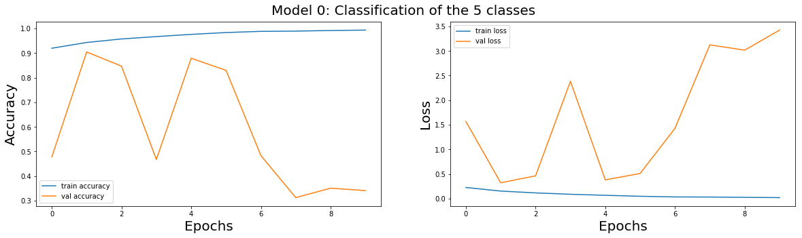
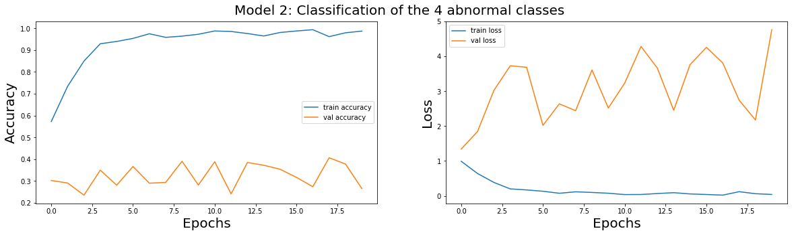
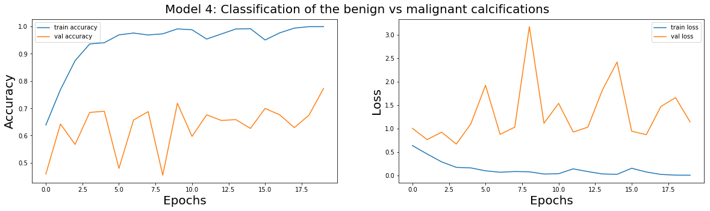
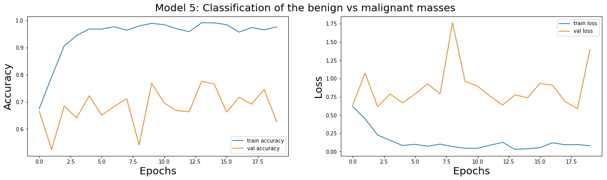
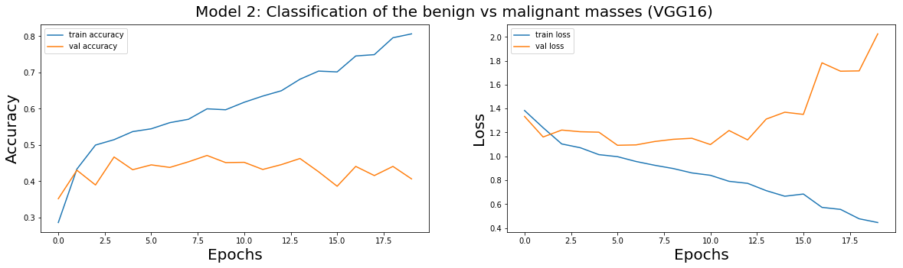
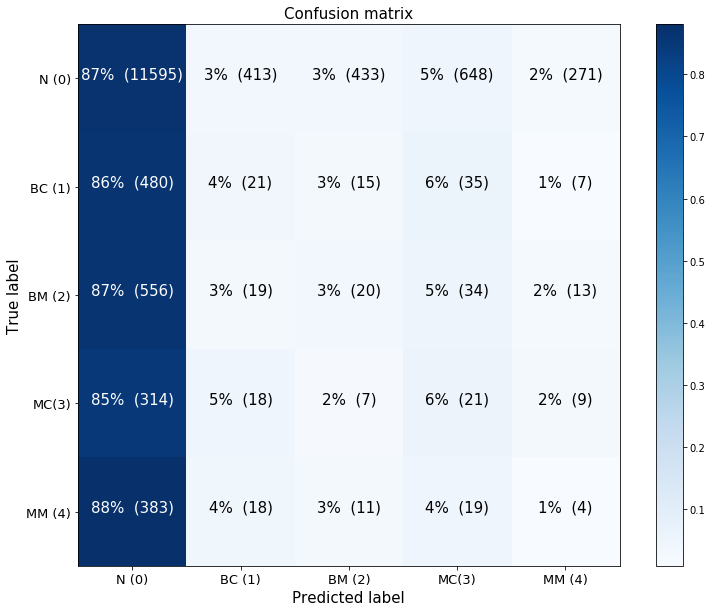
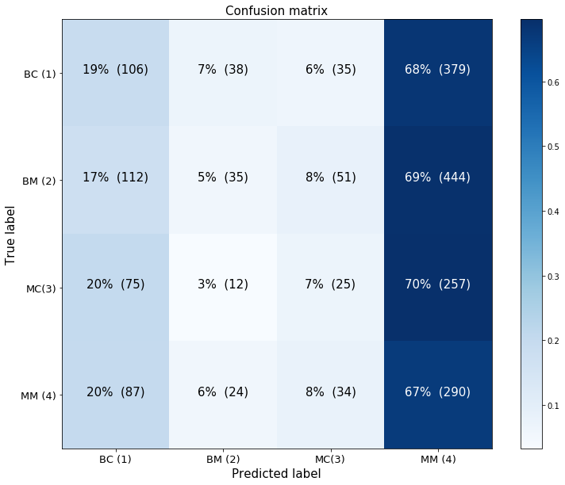

## Contents
{:.no_toc}
*  
{: toc}

## 1. Models Investigated

We prepared 6 different models to test on the ResNet50 architecutre as well as the VGG16 architecture. The models are trained on different partitions and subgroups of the DDSM dataset. The models are:
- Model 0: Raw Pre-Processed DDSM Dataset (Baseline)
    - This model uses all of the data available in the DDSM data set that we selected.
- Model 1: Cleaned Normal Class
    - This model, as discussed in the EDA tab, trains on a dataset where the noisy images (black background and labels) have been removed.
- Model 2: Classification of Abnormalities (Classes 1 to 4)
    - This model trains on the dataset where the "normal" class images have been removed and strictly classifies the different types of abnormalities.
- Model 3: Normal vs Abnormal (Class 0 vs 1-4)
    - This model reduces all the abnormal images to one class and attempts to distinguish between the normal and abnormal images.
- Model 4: Benign vs Malignant Calcification
    - This model looks strictly at the original class 1 and class 3, which are benign and malignant calcifications.
- Model 5: Benign vs Malignant Mass
    - This model looks strictly at the original class 2 and 4, which are benign and malignant masses.
    
We evaluate each model on the training data, the RGB test data, and the grayscale test data. We originally were only using the RGB test data, but because we had such low test accuracy, we worried that the Keras ImageDataGenerator converted the image to RGB in a different way than tf.image.grayscale_to_rgb did, so we saved the images as grayscale and repeated the process. Everything is in this notebook, but note this was a classic "it's the data science process!" moment where we had to take several steps back and try again.

A summary of the training and test accuracies can be found at the conclusion.

    
## 2. Loading the Data

The data was prepared into CSV files that were formated to have the file name and the class labels. The code for this can be found in the EDA tab.

The validation data for training is randomly sampled from the training dataset during model creation, since that is when the data generators are created.


```python
train_df_model_0 = pd.read_csv('data/train_df_model_0.csv')
train_df_model_1 = pd.read_csv('data/train_df_model_1.csv')
train_df_model_2 = pd.read_csv('data/train_df_model_2.csv')
train_df_model_3 = pd.read_csv('data/train_df_model_3.csv')
train_df_model_4 = pd.read_csv('data/train_df_model_4.csv')
train_df_model_5 = pd.read_csv('data/train_df_model_5.csv')
```


```python
test_df_model_0 = pd.read_csv("data/test_df_model_0.csv")
test_df_model_1 = pd.read_csv("data/test_df_model_1.csv")
test_df_model_2 = pd.read_csv("data/test_df_model_2.csv")
test_df_model_3 = pd.read_csv("data/test_df_model_3.csv")
test_df_model_4 = pd.read_csv("data/test_df_model_4.csv")
test_df_model_5 = pd.read_csv("data/test_df_model_5.csv")
test_dfs = [test_df_model_0, test_df_model_1, test_df_model_2, test_df_model_3, test_df_model_4, test_df_model_5]
```


## 3. Setting Up the Models

We will use transfer learning on the pre-trained CCN networks (ResNet will be compared to VGG). We define several hyper-parameters for each model, and define functions to build the data generators and the model, and to evaluate them.


```python
'''HYPER-PARAMETERS'''
#Architecture
architect = 0 #0: Resnet50, 1:VGG
if architect == 0:
    arch_name = 'resnet50'
elif architect == 1:
    arch_name = 'vgg16'

#Image related parameters
H = 299
W = 299
n_channels = 3

#Optimization related parameters
batch_size_train = 32
batch_size_test  = 1

#Model related parameters
model0_epochs = 10
model1_epochs = 5
model2_epochs = 20
model3_epochs = 5
model4_epochs = 20
model5_epochs = 20

model0_classes = 5
model1_classes = 5
model2_classes = 4
model3_classes = 2
model4_classes = 2
model5_classes = 2
```


```python
'''Build the model and DataGenerators.'''
def build_model(n_classes,df,architecture=0,x='filename',y='y', bs_train = 32, lr = 0.0001,H = H,W = W, n_channels = 3):
    #Data generator
    train_df, val_df = train_test_split(df, test_size=0.2, random_state=42, stratify=df[y])
    val_df.reset_index(inplace=True)
    val_df.drop(['index'], axis=1, inplace=True)
    train_datagen = ImageDataGenerator(
            rescale=1./255)
    val_datagen = ImageDataGenerator(rescale=1./255)
    
    train_generator = train_datagen.flow_from_dataframe(
        directory='images',
        dataframe=train_df,
        x_col=x,
        y_col=y,
        # width by height only, not channels
        target_size=(H, W),
        color_mode="rgb",
        batch_size=bs_train,
        class_mode="categorical",
        shuffle=True,
        seed=42
    )
    
    val_generator = val_datagen.flow_from_dataframe(
        directory='images',
        dataframe=val_df,
        x_col=x,
        y_col=y,
        # width by height only, not channels
        target_size=(H, W),
        color_mode="rgb",
        batch_size=bs_train,
        class_mode="categorical",
        shuffle=True,
        seed=42
    )
    #Class weight
    all_classes = df[y].unique()
    class_weights = compute_class_weight(class_weight='balanced', classes=all_classes, y=train_df[y])
    #Model architecture
    inp = Input(shape = (H,W,n_channels))
    
    if architecture == 0:
        model = ResNet50(input_shape=(H,W,n_channels), include_top=False, weights='imagenet')
    elif architecture ==1:
        model = VGG16(input_shape=(H,W,n_channels), include_top=False, weights='imagenet')
    x1 = model(inp)
    x2 = GlobalAveragePooling2D()(x1)
    out = Dense(n_classes, activation='softmax')(x2)

    model = Model(inputs = inp, outputs = out)
    optimizer = Adam(lr=lr)
    model.compile(optimizer=optimizer, loss='categorical_crossentropy', metrics=['accuracy'])
    
    STEP_SIZE_TRAIN = train_generator.n//train_generator.batch_size
    STEP_SIZE_VAL = val_generator.n//val_generator.batch_size
        
    return model, train_generator, val_generator, class_weights, STEP_SIZE_TRAIN, STEP_SIZE_VAL
```


```python
'''Build test DataGenerators for the RGB data.'''
test_gens = {}
for i, df in zip(range(6), test_dfs):
    test_datagen = ImageDataGenerator(rescale=1./255)
    
    test_generator = test_datagen.flow_from_dataframe(
        directory='test_images/',
        dataframe=df,
        x_col='filename',
        y_col='y',
        # width by height only, not channels
        target_size=(H, W),
        color_mode="rgb",
        batch_size=batch_size_test,
        class_mode="categorical",
        shuffle=True,
        seed=42
    )
    test_gens[i] = test_generator
```


    Found 15364 images belonging to 5 classes.
    Found 15364 images belonging to 5 classes.
    Found 2004 images belonging to 4 classes.
    Found 15364 images belonging to 2 classes.
    Found 927 images belonging to 2 classes.
    Found 1077 images belonging to 2 classes.
    


```python
'''Build test DataGenerators for the grayscale data.'''
test_gens_gray = {}
for i, df in zip(range(6), test_dfs):
    test_datagen = ImageDataGenerator(rescale=1./255)
    
    test_generator = test_datagen.flow_from_dataframe(
        directory='test_images_grayscale/',
        dataframe=df,
        x_col='filename',
        y_col='y',
        # width by height only, not channels
        target_size=(H, W),
        color_mode="rgb",
        batch_size=batch_size_test,
        class_mode="categorical",
        shuffle=True,
        seed=42
    )
    test_gens_gray[i] = test_generator
```


    Found 15364 images belonging to 5 classes.
    Found 15364 images belonging to 5 classes.
    Found 2004 images belonging to 4 classes.
    Found 15364 images belonging to 2 classes.
    Found 927 images belonging to 2 classes.
    Found 1077 images belonging to 2 classes.
    


```python
'''Evaluate a given model on test and training data.'''
def evaluate_train_test(model, train_gen=None, step_size_train=None, test_gen=None):
    train_results = None
    if train_gen:
        train_results = model.evaluate_generator(train_gen, steps=step_size_train)
    test_results = None
    if test_gen:
        test_results = model.evaluate_generator(test_gen, test_gen.n)
    return train_results, test_results
```


```python
'''Format evaluation metrics from both a best weights model and a final model.'''
def pretty_metrics(model_id, model_best_weights_train, model_best_weights_test):
    if model_best_weights_train and model_best_weights_test:
        bw_train_loss, bw_train_acc = model_best_weights_train
        bw_test_loss, bw_test_acc = model_best_weights_test
        results = pd.DataFrame()
        results['Model'] = ['Best Weights Model {}'.format(model_id)]
        results['training loss'] = [bw_train_loss]
        results['training acc'] = [bw_train_acc]
        results['test loss'] = [bw_test_loss]
        results['test acc'] = [bw_test_acc]
        return results
    return None
```


```python
'''Save the model weights and history'''
def save_all(model,model_history,model_name,arch_name):
    #Save model and weights
    model.save('models/'+arch_name+'_'+model_name+'.h5')
    model.save_weights('models/'+arch_name+'_'+model_name+'_weights.h5')

    #save history
    with open(arch_name+'_'+model_name+'_history.json', 'w') as f:
        json.dump(model_history.history, f)
```


```python
def load_all(model_name,arch_name):
    model = load_model('models/'+arch_name+'_'+model_name+'.h5')
    model_best_weights = load_model('models/'+arch_name+'_'+model_name+'_best_weights.h5')
    with open(arch_name+'_'+model_name+'_history.json') as json_file:  
        model_history = json.load(json_file)
    return model,model_best_weights,model_history
```


```python
def plot_train(model_history,title):
    fontsize = 20
    fig = plt.figure(figsize=(20,5))
    ax0 = fig.add_subplot(121)
    ax1 = fig.add_subplot(122)
    ax0.plot(model_history['acc'],label='train accuracy')
    ax0.plot(model_history['val_acc'],label='val accuracy')
    ax0.set_xlabel('Epochs',fontsize=fontsize)
    ax0.set_ylabel('Accuracy',fontsize=fontsize)
    ax0.legend();
    ax1.plot(model_history['loss'],label='train loss')
    ax1.plot(model_history['val_loss'],label='val loss')
    ax1.set_xlabel('Epochs',fontsize=fontsize)
    ax1.set_ylabel('Loss',fontsize=fontsize)
    ax1.legend();
    plt.suptitle(title,y=0.95,fontsize=fontsize);
```


## 4. Model Training on ResNet50

First, we use the ResNet50 architecture to train all models. We will report our optimal train accuracy which is based on the maximum cross-validation accuracy as a function of the number of epoch.

### Model 0: Raw Pre-Processed DDSM Dataset (Baseline)

The baseline model classifies the images from the pre-processed DDSM dataset into the following $5$ classes:

- $0$: Normal
- $1$: Benign Calcification
- $2$: Benign Mass
- $3$: Malignant Calcification
- $4$: Malignant Mass


```python
model_0, train_generator_0, val_generator_0, class_weights_0, STEP_SIZE_TRAIN_0, STEP_SIZE_VAL_0 = \
    build_model(model0_classes,
                train_df_model_0,
                architecture = 0,
                x='filename',
                y='y', 
                bs_train = 32, 
                lr = 0.0001,
                H = H,
                W = W,
                n_channels = 3)
```


    /usr/share/anaconda3/lib/python3.6/site-packages/pandas/core/frame.py:3697: SettingWithCopyWarning: 
    A value is trying to be set on a copy of a slice from a DataFrame
    
    See the caveats in the documentation: http://pandas.pydata.org/pandas-docs/stable/indexing.html#indexing-view-versus-copy
      errors=errors)
    

    Found 44708 images belonging to 5 classes.
    Found 11177 images belonging to 5 classes.
    

    /usr/share/anaconda3/lib/python3.6/site-packages/keras_applications/resnet50.py:265: UserWarning: The output shape of `ResNet50(include_top=False)` has been changed since Keras 2.2.0.
      warnings.warn('The output shape of `ResNet50(include_top=False)` '
    


```python
%%time
model_0_name = 'model_0'
filepath_0="models/"+arch_name+"_"+model_0_name+"_best_weights.h5"
checkpoint_0 = ModelCheckpoint(filepath_0, monitor='val_acc', verbose=1, save_best_only=True, mode='max')
callbacks_list_0 = [checkpoint_0]

model_0_history=model_0.fit_generator(generator=train_generator_0,
                    class_weight = class_weights_0,
                    steps_per_epoch=STEP_SIZE_TRAIN_0,
                    validation_data = val_generator_0,
                    validation_steps = STEP_SIZE_VAL_0,
                    epochs=model0_epochs,
                    callbacks=callbacks_list_0

)
```


    Epoch 1/10
    1397/1397 [==============================] - 2414s 2s/step - loss: 0.2245 - acc: 0.9199 - val_loss: 1.5668 - val_acc: 0.4781
    
    Epoch 00001: val_acc improved from -inf to 0.47806, saving model to models/resnet50_model_0_best_weights.h5
    Epoch 2/10
    1397/1397 [==============================] - 2383s 2s/step - loss: 0.1515 - acc: 0.9432 - val_loss: 0.3199 - val_acc: 0.9046
    
    Epoch 00002: val_acc improved from 0.47806 to 0.90462, saving model to models/resnet50_model_0_best_weights.h5
    Epoch 3/10
    1397/1397 [==============================] - 2397s 2s/step - loss: 0.1144 - acc: 0.9577 - val_loss: 0.4617 - val_acc: 0.8474
    
    Epoch 00003: val_acc did not improve from 0.90462
    Epoch 4/10
    1397/1397 [==============================] - 2300s 2s/step - loss: 0.0865 - acc: 0.9673 - val_loss: 2.3846 - val_acc: 0.4676
    
    Epoch 00004: val_acc did not improve from 0.90462
    Epoch 5/10
    1397/1397 [==============================] - 2271s 2s/step - loss: 0.0657 - acc: 0.9761 - val_loss: 0.3797 - val_acc: 0.8793
    
    Epoch 00005: val_acc did not improve from 0.90462
    Epoch 6/10
    1397/1397 [==============================] - 2272s 2s/step - loss: 0.0472 - acc: 0.9836 - val_loss: 0.5091 - val_acc: 0.8299
    
    Epoch 00006: val_acc did not improve from 0.90462
    Epoch 7/10
    1397/1397 [==============================] - 2273s 2s/step - loss: 0.0325 - acc: 0.9885 - val_loss: 1.4287 - val_acc: 0.4834
    
    Epoch 00007: val_acc did not improve from 0.90462
    Epoch 8/10
    1397/1397 [==============================] - 2273s 2s/step - loss: 0.0302 - acc: 0.9896 - val_loss: 3.1246 - val_acc: 0.3127
    
    Epoch 00008: val_acc did not improve from 0.90462
    Epoch 9/10
    1397/1397 [==============================] - 2273s 2s/step - loss: 0.0237 - acc: 0.9919 - val_loss: 3.0178 - val_acc: 0.3511
    
    Epoch 00009: val_acc did not improve from 0.90462
    Epoch 10/10
    1397/1397 [==============================] - 2275s 2s/step - loss: 0.0184 - acc: 0.9938 - val_loss: 3.4259 - val_acc: 0.3412
    
    Epoch 00010: val_acc did not improve from 0.90462
    CPU times: user 3h 37min 14s, sys: 1h 29min 41s, total: 5h 6min 55s
    Wall time: 6h 25min 42s
    


```python
save_all(model_0,model_0_history,model_0_name,arch_name)
```


```python
%%time
model_0,model_0_best_weights,model_0_history = load_all(model_0_name,arch_name)
```


    CPU times: user 1min 30s, sys: 0 ns, total: 1min 30s
    Wall time: 1min 30s
    

#### Model 0 Evaluation

Let us plot the accuracy and loss on the train and cross-validation set as a function of the number of epochs.


```python
plot_train(model_0_history,'Model 0: Classification of the 5 classes')
```





First we evaluate the models with the RGB test data.


```python
%%time
model_0_bw_train_metrics, model_0_bw_test_metrics = evaluate_train_test(model_0_best_weights, 
                                                                        train_generator_0, 
                                                                        STEP_SIZE_TRAIN_0, 
                                                                        test_gens[0])
```


    CPU times: user 19min 22s, sys: 5min 57s, total: 25min 19s
    Wall time: 21min 3s
    


```python
model_0_results = pretty_metrics(0, 
                                 model_0_bw_train_metrics, 
                                 model_0_bw_test_metrics)
display(model_0_results)
```


<div>
<style scoped>
    .dataframe tbody tr th:only-of-type {
        vertical-align: middle;
    }

    .dataframe tbody tr th {
        vertical-align: top;
    }

    .dataframe thead th {
        text-align: right;
    }
</style>
<table border="1" class="dataframe">
  <thead>
    <tr style="text-align: right;">
      <th></th>
      <th>Model</th>
      <th>training loss</th>
      <th>training acc</th>
      <th>test loss</th>
      <th>test acc</th>
    </tr>
  </thead>
  <tbody>
    <tr>
      <th>0</th>
      <td>Model 0</td>
      <td>3.401501</td>
      <td>0.351688</td>
      <td>4.248569</td>
      <td>0.281047</td>
    </tr>
    <tr>
      <th>1</th>
      <td>Best Weights Model 0</td>
      <td>0.284465</td>
      <td>0.918166</td>
      <td>1.557154</td>
      <td>0.758526</td>
    </tr>
  </tbody>
</table>
</div>


Now we evaluate the model only on the grayscale test data. We see that the results are identical to the results for the RGB test data, so we do not reproduce this analysis for the remaining models.


```python
%%time
_ , model_0_gray_test = evaluate_train_test(model_0, test_gen=test_gens_gray[0])
_ , bw_model_0_gray_test = evaluate_train_test(model_0_best_weights, test_gen=test_gens_gray[0])
```


    CPU times: user 16min 52s, sys: 5min 4s, total: 21min 56s
    Wall time: 18min 39s
    


```python
pd.DataFrame({'metric': ['test loss', 'test acc'],
              'Model 0 Best Weights':bw_model_0_gray_test})
```


<div>
<style scoped>
    .dataframe tbody tr th:only-of-type {
        vertical-align: middle;
    }

    .dataframe tbody tr th {
        vertical-align: top;
    }

    .dataframe thead th {
        text-align: right;
    }
</style>
<table border="1" class="dataframe">
  <thead>
    <tr style="text-align: right;">
      <th></th>
      <th>metric</th>
      <th>Model 0</th>
      <th>Model 0 Best Weights</th>
    </tr>
  </thead>
  <tbody>
    <tr>
      <th>0</th>
      <td>test loss</td>
      <td>4.248569</td>
      <td>1.557154</td>
    </tr>
    <tr>
      <th>1</th>
      <td>test acc</td>
      <td>0.281047</td>
      <td>0.758526</td>
    </tr>
  </tbody>
</table>
</div>


### Model  1: Cleaned Normal Class


```python
model_1, train_generator_1, val_generator_1, class_weights_1, STEP_SIZE_TRAIN_1, STEP_SIZE_VAL_1 = \
    build_model(model1_classes,
                train_df_model_1,
                architecture=0,
                x='filename',
                y='y', 
                bs_train = 32, 
                lr = 1.1111,
                H = H,
                W = W,
                n_channels = 3)
```


    /usr/share/anaconda3/lib/python3.6/site-packages/pandas/core/frame.py:3697: SettingWithCopyWarning: 
    A value is trying to be set on a copy of a slice from a DataFrame
    
    See the caveats in the documentation: http://pandas.pydata.org/pandas-docs/stable/indexing.html#indexing-view-versus-copy
      errors=errors)
    

    Found 42261 images belonging to 5 classes.
    Found 10566 images belonging to 5 classes.
    

    /usr/share/anaconda3/lib/python3.6/site-packages/keras_applications/resnet50.py:265: UserWarning: The output shape of `ResNet50(include_top=False)` has been changed since Keras 2.2.0.
      warnings.warn('The output shape of `ResNet50(include_top=False)` '
    


```python
%%time
model_1_name = 'model_1'
filepath_1="models/"+arch_name+"_"+model_1_name+"_best_weights.h5"
checkpoint_1 = ModelCheckpoint(filepath_1, monitor='val_acc', verbose=1, save_best_only=True, mode='max')
callbacks_list_1 = [checkpoint_1]

model_1_history = model_1.fit_generator(generator=train_generator_1,
                    class_weight = class_weights_1,
                    steps_per_epoch=STEP_SIZE_TRAIN_1,
                    validation_data = val_generator_1,
                    validation_steps = STEP_SIZE_VAL_1,
                    epochs=model1_epochs,
                    callbacks=callbacks_list_1
)
```


    Epoch 1/5
    1320/1320 [==============================] - 2170s 2s/step - loss: 2.2231 - acc: 0.8616 - val_loss: 2.2239 - val_acc: 0.8620
    
    Epoch 00001: val_acc improved from -inf to 0.86203, saving model to models/resnet50_model_1_best_weights.h5
    Epoch 2/5
     710/1320 [===============>..............] - ETA: 15:15 - loss: 2.2117 - acc: 0.8628


```python
save_all(model_1,model_1_history,model_1_name,arch_name)
```


```python
%%time
model_1,model_1_best_weights,model_1_history = load_all(model_1_name,arch_name)
```


#### Model 1 Evaluation

The training of model $1$ was interrupted by a sudden loss of connection with the Jupyter Hub server. Therefore, while we have save the model with the best weights, the history was not saved in order to plot the accuracy and loss vs number of epochs.


```python
# plot_train(model_1_history,'Model 1: Classification of the 5 cleaned classes')
```


We can evaluate the model on the test set.


```python
%%time
model_1_bw_train_metrics, model_1_bw_test_metrics = evaluate_train_test(model_1_best_weights, 
                                                                        train_generator_1, 
                                                                        STEP_SIZE_TRAIN_1, 
                                                                        test_gens[1])
```


```python
model_1_results = pretty_metrics(1, 
                                 model_1_bw_train_metrics, 
                                 model_1_bw_test_metrics)
display(model_1_results)
```


### Model 2: Classification of Abnormalities (Classes 1 to 4)


```python
model_2, train_generator_2, val_generator_2, class_weights_2, STEP_SIZE_TRAIN_2, STEP_SIZE_VAL_2 = \
    build_model(model2_classes,
                train_df_model_2,
                architecture=0,
                x='filename',
                y='y', 
                bs_train = 32, 
                lr = 0.0001,
                H = H,
                W = W, 
                n_channels = 3)
```


    /usr/share/anaconda3/lib/python3.6/site-packages/pandas/core/frame.py:3697: SettingWithCopyWarning: 
    A value is trying to be set on a copy of a slice from a DataFrame
    
    See the caveats in the documentation: http://pandas.pydata.org/pandas-docs/stable/indexing.html#indexing-view-versus-copy
      errors=errors)
    

    Found 5831 images belonging to 4 classes.
    Found 1458 images belonging to 4 classes.
    

    /usr/share/anaconda3/lib/python3.6/site-packages/keras_applications/resnet50.py:265: UserWarning: The output shape of `ResNet50(include_top=False)` has been changed since Keras 2.2.0.
      warnings.warn('The output shape of `ResNet50(include_top=False)` '
    


```python
%%time
model_2_name = 'model_2'
filepath_2="models/"+arch_name+"_"+model_2_name+"_best_weights.h5"
checkpoint_2 = ModelCheckpoint(filepath_2, monitor='val_acc', verbose=1, save_best_only=True, mode='max')
callbacks_list_2 = [checkpoint_2]

model_2_history = model_2.fit_generator(generator=train_generator_2,
                    class_weight = class_weights_2,
                    steps_per_epoch=STEP_SIZE_TRAIN_2,
                    validation_data = val_generator_2,
                    validation_steps = STEP_SIZE_VAL_2,
                    epochs=model2_epochs,
                    callbacks=callbacks_list_2

)
```


    Epoch 1/20
    182/182 [==============================] - 323s 2s/step - loss: 0.9912 - acc: 0.5726 - val_loss: 1.3421 - val_acc: 0.3028
    
    Epoch 00001: val_acc improved from -inf to 0.30278, saving model to models/resnet50_model_2_best_weights.h5
    Epoch 2/20
    182/182 [==============================] - 305s 2s/step - loss: 0.6409 - acc: 0.7332 - val_loss: 1.8454 - val_acc: 0.2910
    
    Epoch 00002: val_acc did not improve from 0.30278
    Epoch 3/20
    182/182 [==============================] - 302s 2s/step - loss: 0.3885 - acc: 0.8469 - val_loss: 3.0226 - val_acc: 0.2356
    
    Epoch 00003: val_acc did not improve from 0.30278
    Epoch 4/20
    182/182 [==============================] - 302s 2s/step - loss: 0.2016 - acc: 0.9285 - val_loss: 3.7270 - val_acc: 0.3499
    
    Epoch 00004: val_acc improved from 0.30278 to 0.34993, saving model to models/resnet50_model_2_best_weights.h5
    Epoch 5/20
    182/182 [==============================] - 302s 2s/step - loss: 0.1715 - acc: 0.9389 - val_loss: 3.6852 - val_acc: 0.2812
    
    Epoch 00005: val_acc did not improve from 0.34993
    Epoch 6/20
    182/182 [==============================] - 302s 2s/step - loss: 0.1343 - acc: 0.9522 - val_loss: 2.0205 - val_acc: 0.3668
    
    Epoch 00006: val_acc improved from 0.34993 to 0.36676, saving model to models/resnet50_model_2_best_weights.h5
    Epoch 7/20
    182/182 [==============================] - 302s 2s/step - loss: 0.0759 - acc: 0.9746 - val_loss: 2.6354 - val_acc: 0.2903
    
    Epoch 00007: val_acc did not improve from 0.36676
    Epoch 8/20
    182/182 [==============================] - 302s 2s/step - loss: 0.1192 - acc: 0.9564 - val_loss: 2.4419 - val_acc: 0.2938
    
    Epoch 00008: val_acc did not improve from 0.36676
    Epoch 9/20
    182/182 [==============================] - 303s 2s/step - loss: 0.1017 - acc: 0.9632 - val_loss: 3.6073 - val_acc: 0.3906
    
    Epoch 00009: val_acc improved from 0.36676 to 0.39060, saving model to models/resnet50_model_2_best_weights.h5
    Epoch 10/20
    182/182 [==============================] - 303s 2s/step - loss: 0.0769 - acc: 0.9711 - val_loss: 2.5166 - val_acc: 0.2819
    
    Epoch 00010: val_acc did not improve from 0.39060
    Epoch 11/20
    182/182 [==============================] - 303s 2s/step - loss: 0.0380 - acc: 0.9873 - val_loss: 3.2304 - val_acc: 0.3885
    
    Epoch 00011: val_acc did not improve from 0.39060
    Epoch 12/20
    182/182 [==============================] - 303s 2s/step - loss: 0.0402 - acc: 0.9851 - val_loss: 4.2793 - val_acc: 0.2412
    
    Epoch 00012: val_acc did not improve from 0.39060
    Epoch 13/20
    182/182 [==============================] - 302s 2s/step - loss: 0.0672 - acc: 0.9756 - val_loss: 3.6593 - val_acc: 0.3850
    
    Epoch 00013: val_acc did not improve from 0.39060
    Epoch 14/20
    182/182 [==============================] - 303s 2s/step - loss: 0.0919 - acc: 0.9645 - val_loss: 2.4533 - val_acc: 0.3724
    
    Epoch 00014: val_acc did not improve from 0.39060
    Epoch 15/20
    182/182 [==============================] - 303s 2s/step - loss: 0.0560 - acc: 0.9804 - val_loss: 3.7602 - val_acc: 0.3541
    
    Epoch 00015: val_acc did not improve from 0.39060
    Epoch 16/20
    182/182 [==============================] - 303s 2s/step - loss: 0.0400 - acc: 0.9873 - val_loss: 4.2547 - val_acc: 0.3170
    
    Epoch 00016: val_acc did not improve from 0.39060
    Epoch 17/20
    182/182 [==============================] - 303s 2s/step - loss: 0.0221 - acc: 0.9931 - val_loss: 3.8088 - val_acc: 0.2742
    
    Epoch 00017: val_acc did not improve from 0.39060
    Epoch 18/20
    182/182 [==============================] - 303s 2s/step - loss: 0.1226 - acc: 0.9609 - val_loss: 2.7436 - val_acc: 0.4067
    
    Epoch 00018: val_acc improved from 0.39060 to 0.40673, saving model to models/resnet50_model_2_best_weights.h5
    Epoch 19/20
    182/182 [==============================] - 303s 2s/step - loss: 0.0639 - acc: 0.9784 - val_loss: 2.1737 - val_acc: 0.3780
    
    Epoch 00019: val_acc did not improve from 0.40673
    Epoch 20/20
    182/182 [==============================] - 304s 2s/step - loss: 0.0412 - acc: 0.9868 - val_loss: 4.7604 - val_acc: 0.2658
    
    Epoch 00020: val_acc did not improve from 0.40673
    CPU times: user 59min 13s, sys: 24min 16s, total: 1h 23min 29s
    Wall time: 1h 41min 35s
    


```python
save_all(model_2,model_2_history,model_2_name,arch_name)
```


```python
%%time
model_2,model_2_best_weights,model_2_history = load_all(model_2_name,arch_name)
```


    CPU times: user 1min 42s, sys: 0 ns, total: 1min 42s
    Wall time: 1min 42s
    

#### Model 2 Evaluation


```python
plot_train(model_2_history,'Model 2: Classification of the 4 abnormal classes')
```





```python
%%time
model_2_bw_train_metrics, model_2_bw_test_metrics = evaluate_train_test(model_2_best_weights, 
                                                                        train_generator_2, 
                                                                        STEP_SIZE_TRAIN_2, 
                                                                        test_gens[2])
```


```python
model_2_results = pretty_metrics(2, model_2_train_metrics, 
                                 model_2_test_metrics, 
                                 model_2_bw_train_metrics, 
                                 model_2_bw_test_metrics)
display(model_2_results)
```


### Model 3: Normal vs Abnormal (Class 0 vs 1-4)


```python
model_3, train_generator_3, val_generator_3, class_weights_3, STEP_SIZE_TRAIN_3, STEP_SIZE_VAL_3 = \
    build_model(model3_classes,
                train_df_model_3,
                architecture=0,
                x='filename',
                y='y', 
                bs_train = 32, 
                lr = 0.0001,
                H = H,
                W = W, 
                n_channels = 3)
```


    /usr/share/anaconda3/lib/python3.6/site-packages/pandas/core/frame.py:3697: SettingWithCopyWarning: 
    A value is trying to be set on a copy of a slice from a DataFrame
    
    See the caveats in the documentation: http://pandas.pydata.org/pandas-docs/stable/indexing.html#indexing-view-versus-copy
      errors=errors)
    

    Found 42261 images belonging to 2 classes.
    Found 10566 images belonging to 2 classes.
    

    /usr/share/anaconda3/lib/python3.6/site-packages/keras_applications/resnet50.py:265: UserWarning: The output shape of `ResNet50(include_top=False)` has been changed since Keras 2.2.0.
      warnings.warn('The output shape of `ResNet50(include_top=False)` '
    


```python
%%time
model_3_name = 'model_3'
filepath_3="models/"+arch_name+"_"+model_3_name+"_best_weights.h5"
checkpoint_3 = ModelCheckpoint(filepath_3, monitor='val_acc', verbose=1, save_best_only=True, mode='max')
callbacks_list_3 = [checkpoint_3]

model_3_history = model_3.fit_generator(generator=train_generator_3,
                    class_weight = class_weights_3,
                    steps_per_epoch=STEP_SIZE_TRAIN_3,
                    validation_data = val_generator_3,
                    validation_steps = STEP_SIZE_VAL_3,
                    epochs=model3_epochs,
                    callbacks=callbacks_list_3
)
```


    Epoch 1/5
    1320/1320 [==============================] - 2232s 2s/step - loss: 0.1032 - acc: 0.9588 - val_loss: 0.5071 - val_acc: 0.7451
    
    Epoch 00001: val_acc improved from -inf to 0.74508, saving model to models/resnet50_model_3_best_weights.h5
    Epoch 2/5
      49/1320 [>.............................] - ETA: 33:42 - loss: 0.0444 - acc: 0.9815


    ---------------------------------------------------------------------------

    KeyboardInterrupt                         Traceback (most recent call last)

    <timed exec> in <module>
    

    /usr/share/anaconda3/lib/python3.6/site-packages/keras/legacy/interfaces.py in wrapper(*args, **kwargs)
         89                 warnings.warn('Update your `' + object_name + '` call to the ' +
         90                               'Keras 2 API: ' + signature, stacklevel=2)
    ---> 91             return func(*args, **kwargs)
         92         wrapper._original_function = func
         93         return wrapper
    

    /usr/share/anaconda3/lib/python3.6/site-packages/keras/engine/training.py in fit_generator(self, generator, steps_per_epoch, epochs, verbose, callbacks, validation_data, validation_steps, class_weight, max_queue_size, workers, use_multiprocessing, shuffle, initial_epoch)
       1416             use_multiprocessing=use_multiprocessing,
       1417             shuffle=shuffle,
    -> 1418             initial_epoch=initial_epoch)
       1419 
       1420     @interfaces.legacy_generator_methods_support
    

    /usr/share/anaconda3/lib/python3.6/site-packages/keras/engine/training_generator.py in fit_generator(model, generator, steps_per_epoch, epochs, verbose, callbacks, validation_data, validation_steps, class_weight, max_queue_size, workers, use_multiprocessing, shuffle, initial_epoch)
        215                 outs = model.train_on_batch(x, y,
        216                                             sample_weight=sample_weight,
    --> 217                                             class_weight=class_weight)
        218 
        219                 outs = to_list(outs)
    

    /usr/share/anaconda3/lib/python3.6/site-packages/keras/engine/training.py in train_on_batch(self, x, y, sample_weight, class_weight)
       1215             ins = x + y + sample_weights
       1216         self._make_train_function()
    -> 1217         outputs = self.train_function(ins)
       1218         return unpack_singleton(outputs)
       1219 
    

    /usr/share/anaconda3/lib/python3.6/site-packages/keras/backend/tensorflow_backend.py in __call__(self, inputs)
       2713                 return self._legacy_call(inputs)
       2714 
    -> 2715             return self._call(inputs)
       2716         else:
       2717             if py_any(is_tensor(x) for x in inputs):
    

    /usr/share/anaconda3/lib/python3.6/site-packages/keras/backend/tensorflow_backend.py in _call(self, inputs)
       2673             fetched = self._callable_fn(*array_vals, run_metadata=self.run_metadata)
       2674         else:
    -> 2675             fetched = self._callable_fn(*array_vals)
       2676         return fetched[:len(self.outputs)]
       2677 
    

    /usr/share/anaconda3/lib/python3.6/site-packages/tensorflow/python/client/session.py in __call__(self, *args, **kwargs)
       1437           ret = tf_session.TF_SessionRunCallable(
       1438               self._session._session, self._handle, args, status,
    -> 1439               run_metadata_ptr)
       1440         if run_metadata:
       1441           proto_data = tf_session.TF_GetBuffer(run_metadata_ptr)
    

    KeyboardInterrupt: 


```python
save_all(model_3,model_3_history,model_3_name,arch_name)
```


```python
%%time
model_3,model_3_best_weights,model_3_history = load_all(model_3_name,arch_name)
```


#### Model 3 Evaluation
The training of model $3$ was interrupted by a sudden loss of connection with the Jupyter Hub server. Therefore, while we have save the model with the best weights, the history was not saved in order to plot the accuracy and loss vs number of epochs.


```python
# plot_train(model_3_history,'Model 3: Classification of the abnormal vs normal images')
```


```python
%%time
model_3_bw_train_metrics, model_3_bw_test_metrics = evaluate_train_test(model_3_best_weights, 
                                                                        train_generator_3, 
                                                                        STEP_SIZE_TRAIN_3, 
                                                                        test_gens[3])
```


```python
model_3_results = pretty_metrics(3, 
                                 model_3_bw_train_metrics, 
                                 model_3_bw_test_metrics)
display(model_3_results)
```


Now we evaluate the model only on the grayscale test data. Again, the results are identical to the RGB image results.

### Model 4: Benign vs Malignant Calcification


```python
model_4, train_generator_4, val_generator_4, class_weights_4, STEP_SIZE_TRAIN_4, STEP_SIZE_VAL_4 = \
    build_model(model4_classes,
                train_df_model_4,
                architecture=0,
                x='filename',
                y='y', 
                bs_train = 32, 
                lr = 0.0001,
                H = H,
                W = W, 
                n_channels = 3)
```


    /usr/share/anaconda3/lib/python3.6/site-packages/pandas/core/frame.py:3697: SettingWithCopyWarning: 
    A value is trying to be set on a copy of a slice from a DataFrame
    
    See the caveats in the documentation: http://pandas.pydata.org/pandas-docs/stable/indexing.html#indexing-view-versus-copy
      errors=errors)
    

    Found 2852 images belonging to 2 classes.
    Found 714 images belonging to 2 classes.
    

    /usr/share/anaconda3/lib/python3.6/site-packages/keras_applications/resnet50.py:265: UserWarning: The output shape of `ResNet50(include_top=False)` has been changed since Keras 2.2.0.
      warnings.warn('The output shape of `ResNet50(include_top=False)` '
    


```python
%%time
model_4_name = 'model_4'
filepath_4="models/"+arch_name+"_"+model_4_name+"_best_weights.h5"
checkpoint_4 = ModelCheckpoint(filepath_4, monitor='val_acc', verbose=1, save_best_only=True, mode='max')
callbacks_list_4 = [checkpoint_4]

model_4_history = model_4.fit_generator(generator=train_generator_4,
                    class_weight = class_weights_4,
                    steps_per_epoch=STEP_SIZE_TRAIN_4,
                    validation_data = val_generator_4,
                    validation_steps = STEP_SIZE_VAL_4,
                    epochs=model4_epochs,
                    callbacks=callbacks_list_4
)
```


    Epoch 1/20
    89/89 [==============================] - 169s 2s/step - loss: 0.6356 - acc: 0.6387 - val_loss: 1.0048 - val_acc: 0.4588
    
    Epoch 00001: val_acc improved from -inf to 0.45881, saving model to models/resnet50_model_4_best_weights.h5
    Epoch 2/20
    89/89 [==============================] - 149s 2s/step - loss: 0.4564 - acc: 0.7683 - val_loss: 0.7639 - val_acc: 0.6422
    
    Epoch 00002: val_acc improved from 0.45881 to 0.64223, saving model to models/resnet50_model_4_best_weights.h5
    Epoch 3/20
    89/89 [==============================] - 147s 2s/step - loss: 0.2891 - acc: 0.8733 - val_loss: 0.9219 - val_acc: 0.5674
    
    Epoch 00003: val_acc did not improve from 0.64223
    Epoch 4/20
    89/89 [==============================] - 147s 2s/step - loss: 0.1746 - acc: 0.9340 - val_loss: 0.6685 - val_acc: 0.6848
    
    Epoch 00004: val_acc improved from 0.64223 to 0.68475, saving model to models/resnet50_model_4_best_weights.h5
    Epoch 5/20
    89/89 [==============================] - 147s 2s/step - loss: 0.1606 - acc: 0.9386 - val_loss: 1.1013 - val_acc: 0.6891
    
    Epoch 00005: val_acc improved from 0.68475 to 0.68915, saving model to models/resnet50_model_4_best_weights.h5
    Epoch 6/20
    89/89 [==============================] - 147s 2s/step - loss: 0.0991 - acc: 0.9694 - val_loss: 1.9235 - val_acc: 0.4795
    
    Epoch 00006: val_acc did not improve from 0.68915
    Epoch 7/20
    89/89 [==============================] - 147s 2s/step - loss: 0.0675 - acc: 0.9761 - val_loss: 0.8757 - val_acc: 0.6569
    
    Epoch 00007: val_acc did not improve from 0.68915
    Epoch 8/20
    89/89 [==============================] - 147s 2s/step - loss: 0.0869 - acc: 0.9667 - val_loss: 1.0296 - val_acc: 0.6877
    
    Epoch 00008: val_acc did not improve from 0.68915
    Epoch 9/20
    89/89 [==============================] - 147s 2s/step - loss: 0.0761 - acc: 0.9733 - val_loss: 3.1756 - val_acc: 0.4545
    
    Epoch 00009: val_acc did not improve from 0.68915
    Epoch 10/20
    89/89 [==============================] - 147s 2s/step - loss: 0.0288 - acc: 0.9912 - val_loss: 1.1129 - val_acc: 0.7185
    
    Epoch 00010: val_acc improved from 0.68915 to 0.71848, saving model to models/resnet50_model_4_best_weights.h5
    Epoch 11/20
    89/89 [==============================] - 147s 2s/step - loss: 0.0349 - acc: 0.9881 - val_loss: 1.5383 - val_acc: 0.5968
    
    Epoch 00011: val_acc did not improve from 0.71848
    Epoch 12/20
    89/89 [==============================] - 147s 2s/step - loss: 0.1409 - acc: 0.9543 - val_loss: 0.9256 - val_acc: 0.6760
    
    Epoch 00012: val_acc did not improve from 0.71848
    Epoch 13/20
    89/89 [==============================] - 147s 2s/step - loss: 0.0802 - acc: 0.9726 - val_loss: 1.0292 - val_acc: 0.6554
    
    Epoch 00013: val_acc did not improve from 0.71848
    Epoch 14/20
    89/89 [==============================] - 147s 2s/step - loss: 0.0308 - acc: 0.9909 - val_loss: 1.8242 - val_acc: 0.6584
    
    Epoch 00014: val_acc did not improve from 0.71848
    Epoch 15/20
    89/89 [==============================] - 147s 2s/step - loss: 0.0225 - acc: 0.9919 - val_loss: 2.4195 - val_acc: 0.6261
    
    Epoch 00015: val_acc did not improve from 0.71848
    Epoch 16/20
    89/89 [==============================] - 147s 2s/step - loss: 0.1727 - acc: 0.9484 - val_loss: 0.9426 - val_acc: 0.6994
    
    Epoch 00016: val_acc did not improve from 0.71848
    Epoch 17/20
    89/89 [==============================] - 147s 2s/step - loss: 0.0759 - acc: 0.9744 - val_loss: 0.8693 - val_acc: 0.6760
    
    Epoch 00017: val_acc did not improve from 0.71848
    Epoch 18/20
    89/89 [==============================] - 147s 2s/step - loss: 0.0202 - acc: 0.9940 - val_loss: 1.4713 - val_acc: 0.6290
    
    Epoch 00018: val_acc did not improve from 0.71848
    Epoch 19/20
    89/89 [==============================] - 147s 2s/step - loss: 0.0053 - acc: 0.9993 - val_loss: 1.6606 - val_acc: 0.6745
    
    Epoch 00019: val_acc did not improve from 0.71848
    Epoch 20/20
    89/89 [==============================] - 147s 2s/step - loss: 0.0036 - acc: 0.9993 - val_loss: 1.1412 - val_acc: 0.7727
    
    Epoch 00020: val_acc improved from 0.71848 to 0.77273, saving model to models/resnet50_model_4_best_weights.h5
    CPU times: user 39min 13s, sys: 11min 5s, total: 50min 19s
    Wall time: 49min 48s
    


```python
save_all(model_4,model_4_history,model_4_name,arch_name)
```


```python
model_4,model_4_best_weights,model_4_history = load_all(model_4_name,arch_name)
```


#### Model 4 Evaluation


```python
plot_train(model_4_history,'Model 4: Classification of the benign vs malignant calcifications')
```





```python
%%time
model_4_bw_train_metrics, model_4_bw_test_metrics = evaluate_train_test(model_4_best_weights, 
                                                                        train_generator_4, 
                                                                        STEP_SIZE_TRAIN_4, 
                                                                        test_gens[4])
```


    CPU times: user 2min 34s, sys: 18.9 s, total: 2min 53s
    Wall time: 1min 34s
    


```python
model_4_results = pretty_metrics(4,
                                 model_4_bw_train_metrics, 
                                 model_4_bw_test_metrics)
display(model_4_results)
```


<div>
<style scoped>
    .dataframe tbody tr th:only-of-type {
        vertical-align: middle;
    }

    .dataframe tbody tr th {
        vertical-align: top;
    }

    .dataframe thead th {
        text-align: right;
    }
</style>
<table border="1" class="dataframe">
  <thead>
    <tr style="text-align: right;">
      <th></th>
      <th>Model</th>
      <th>training loss</th>
      <th>training acc</th>
      <th>test loss</th>
      <th>test acc</th>
    </tr>
  </thead>
  <tbody>
    <tr>
      <th>0</th>
      <td>Model 4</td>
      <td>0.002953</td>
      <td>0.999291</td>
      <td>1.889246</td>
      <td>0.523193</td>
    </tr>
    <tr>
      <th>1</th>
      <td>Best Weights Model 4</td>
      <td>0.003161</td>
      <td>0.999291</td>
      <td>1.883495</td>
      <td>0.523193</td>
    </tr>
  </tbody>
</table>
</div>


### Model 5: Benign vs Malignant Mass


```python
model_5, train_generator_5, val_generator_5, class_weights_5, STEP_SIZE_TRAIN_5, STEP_SIZE_VAL_5 = \
    build_model(model5_classes,
                train_df_model_5,
                architecture=0,
                x='filename',
                y='y', 
                bs_train = 32, 
                lr = 0.0001,
                H = H,
                W = W, 
                n_channels = 3)
```


    /usr/share/anaconda3/lib/python3.6/site-packages/pandas/core/frame.py:3697: SettingWithCopyWarning: 
    A value is trying to be set on a copy of a slice from a DataFrame
    
    See the caveats in the documentation: http://pandas.pydata.org/pandas-docs/stable/indexing.html#indexing-view-versus-copy
      errors=errors)
    

    Found 2978 images belonging to 2 classes.
    Found 745 images belonging to 2 classes.
    

    /usr/share/anaconda3/lib/python3.6/site-packages/keras_applications/resnet50.py:265: UserWarning: The output shape of `ResNet50(include_top=False)` has been changed since Keras 2.2.0.
      warnings.warn('The output shape of `ResNet50(include_top=False)` '
    


```python
%%time
model_5_name = 'model_5'
filepath_5="models/"+arch_name+"_"+model_5_name+"_best_weights.h5"
checkpoint_5 = ModelCheckpoint(filepath_5, monitor='val_acc', verbose=1, save_best_only=True, mode='max')
callbacks_list_5 = [checkpoint_5]

model_5_history = model_5.fit_generator(generator=train_generator_5,
                    class_weight = class_weights_5,
                    steps_per_epoch=STEP_SIZE_TRAIN_5,
                    validation_data = val_generator_5,
                    validation_steps = STEP_SIZE_VAL_5,
                    epochs=model5_epochs,
                    callbacks=callbacks_list_5

)
```


    Epoch 1/20
    93/93 [==============================] - 197s 2s/step - loss: 0.6166 - acc: 0.6744 - val_loss: 0.6310 - val_acc: 0.6658
    
    Epoch 00001: val_acc improved from -inf to 0.66576, saving model to models/resnet50_model_5_best_weights.h5
    Epoch 2/20
    93/93 [==============================] - 156s 2s/step - loss: 0.4446 - acc: 0.7947 - val_loss: 1.0721 - val_acc: 0.5245
    
    Epoch 00002: val_acc did not improve from 0.66576
    Epoch 3/20
    93/93 [==============================] - 154s 2s/step - loss: 0.2239 - acc: 0.9069 - val_loss: 0.6140 - val_acc: 0.6844
    
    Epoch 00003: val_acc improved from 0.66576 to 0.68443, saving model to models/resnet50_model_5_best_weights.h5
    Epoch 4/20
    93/93 [==============================] - 154s 2s/step - loss: 0.1579 - acc: 0.9399 - val_loss: 0.7869 - val_acc: 0.6410
    
    Epoch 00004: val_acc did not improve from 0.68443
    Epoch 5/20
    93/93 [==============================] - 154s 2s/step - loss: 0.0813 - acc: 0.9684 - val_loss: 0.6650 - val_acc: 0.7223
    
    Epoch 00005: val_acc improved from 0.68443 to 0.72230, saving model to models/resnet50_model_5_best_weights.h5
    Epoch 6/20
    93/93 [==============================] - 154s 2s/step - loss: 0.0980 - acc: 0.9681 - val_loss: 0.7855 - val_acc: 0.6508
    
    Epoch 00006: val_acc did not improve from 0.72230
    Epoch 7/20
    93/93 [==============================] - 155s 2s/step - loss: 0.0719 - acc: 0.9768 - val_loss: 0.9263 - val_acc: 0.6830
    
    Epoch 00007: val_acc did not improve from 0.72230
    Epoch 8/20
    93/93 [==============================] - 155s 2s/step - loss: 0.1046 - acc: 0.9591 - val_loss: 0.7889 - val_acc: 0.7111
    
    Epoch 00008: val_acc did not improve from 0.72230
    Epoch 9/20
    93/93 [==============================] - 154s 2s/step - loss: 0.0669 - acc: 0.9798 - val_loss: 1.7616 - val_acc: 0.5414
    
    Epoch 00009: val_acc did not improve from 0.72230
    Epoch 10/20
    93/93 [==============================] - 155s 2s/step - loss: 0.0429 - acc: 0.9889 - val_loss: 0.9603 - val_acc: 0.7686
    
    Epoch 00010: val_acc improved from 0.72230 to 0.76858, saving model to models/resnet50_model_5_best_weights.h5
    Epoch 11/20
    93/93 [==============================] - 155s 2s/step - loss: 0.0437 - acc: 0.9842 - val_loss: 0.8931 - val_acc: 0.6957
    
    Epoch 00011: val_acc did not improve from 0.76858
    Epoch 12/20
    93/93 [==============================] - 155s 2s/step - loss: 0.1329 - acc: 0.9644 - val_loss: 0.7565 - val_acc: 0.6676
    
    Epoch 00012: val_acc did not improve from 0.76858
    Epoch 13/20
    93/93 [==============================] - 155s 2s/step - loss: 0.1340 - acc: 0.9537 - val_loss: 0.6352 - val_acc: 0.6634
    
    Epoch 00013: val_acc did not improve from 0.76858
    Epoch 14/20
    93/93 [==============================] - 155s 2s/step - loss: 0.0275 - acc: 0.9913 - val_loss: 0.7748 - val_acc: 0.7756
    
    Epoch 00014: val_acc improved from 0.76858 to 0.77560, saving model to models/resnet50_model_5_best_weights.h5
    Epoch 15/20
    93/93 [==============================] - 155s 2s/step - loss: 0.0411 - acc: 0.9909 - val_loss: 0.7349 - val_acc: 0.7658
    
    Epoch 00015: val_acc did not improve from 0.77560
    Epoch 16/20
    93/93 [==============================] - 155s 2s/step - loss: 0.0550 - acc: 0.9842 - val_loss: 0.9324 - val_acc: 0.6620
    
    Epoch 00016: val_acc did not improve from 0.77560
    Epoch 17/20
    93/93 [==============================] - 155s 2s/step - loss: 0.1519 - acc: 0.9520 - val_loss: 0.9066 - val_acc: 0.7167
    
    Epoch 00017: val_acc did not improve from 0.77560
    Epoch 18/20
    93/93 [==============================] - 155s 2s/step - loss: 0.1034 - acc: 0.9688 - val_loss: 0.6824 - val_acc: 0.6914
    
    Epoch 00018: val_acc did not improve from 0.77560
    Epoch 19/20
    93/93 [==============================] - 155s 2s/step - loss: 0.1015 - acc: 0.9604 - val_loss: 0.5866 - val_acc: 0.7461
    
    Epoch 00019: val_acc did not improve from 0.77560
    Epoch 20/20
    93/93 [==============================] - 155s 2s/step - loss: 0.0827 - acc: 0.9712 - val_loss: 1.3982 - val_acc: 0.6269
    
    Epoch 00020: val_acc did not improve from 0.77560
    CPU times: user 30min 40s, sys: 11min 42s, total: 42min 23s
    Wall time: 52min 43s
    


```python
save_all(model_5,model_5_history,model_5_name,arch_name)
```


```python
%%time
model_5,model_5_best_weights,model_5_history = load_all(model_5_name,arch_name)
```


    CPU times: user 4min 40s, sys: 0 ns, total: 4min 40s
    Wall time: 4min 40s
    

#### Model 5 Evaluation


```python
plot_train(model_5_history,'Model 5: Classification of the benign vs malignant masses')
```





```python
%%time
model_5_bw_train_metrics, model_5_bw_test_metrics = evaluate_train_test(model_5_best_weights, 
                                                                        train_generator_5, 
                                                                        STEP_SIZE_TRAIN_5, 
                                                                        test_gens[5])
```


    CPU times: user 1min 52s, sys: 23.8 s, total: 2min 16s
    Wall time: 1min 56s
    


```python
model_5_results = pretty_metrics(5,
                                 model_5_bw_train_metrics, 
                                 model_5_bw_test_metrics)
display(model_5_results)
```


<div>
<style scoped>
    .dataframe tbody tr th:only-of-type {
        vertical-align: middle;
    }

    .dataframe tbody tr th {
        vertical-align: top;
    }

    .dataframe thead th {
        text-align: right;
    }
</style>
<table border="1" class="dataframe">
  <thead>
    <tr style="text-align: right;">
      <th></th>
      <th>Model</th>
      <th>training loss</th>
      <th>training acc</th>
      <th>test loss</th>
      <th>test acc</th>
    </tr>
  </thead>
  <tbody>
    <tr>
      <th>0</th>
      <td>Model 5</td>
      <td>1.104476</td>
      <td>0.667006</td>
      <td>1.556385</td>
      <td>0.482823</td>
    </tr>
    <tr>
      <th>1</th>
      <td>Best Weights Model 5</td>
      <td>0.218339</td>
      <td>0.914800</td>
      <td>1.711712</td>
      <td>0.578459</td>
    </tr>
  </tbody>
</table>
</div>


Now we evaluate the model only on the grayscale test data. Again, the results are identical to the RGB image results.

### Summary of Results for Resnet50

Because the RGB and grayscale test data results were essentially the same, we simply show the test results from the RGB data.


```python
all_results = pd.concat([model_0_results, 
                         model_1_results, model_2_results, model_3_results, model_4_results, model_5_results])
display(all_results_df)
```


### Analysis of the Results

As can be seen from the table above, there exist a clear gap between the very high training and very low test set accuracies for each model. This might indicate that we are over-fitting on the training set. However, as shown for models $0$, $4$, and $5$, the accuracy on the cross-validation is above $70$% and can even attain $90$% (model $0$). Only model $2$ seems to indicate over-fitting with very low accuracy on the cross-validation set with the number of epochs. To investigate if this low test accuracy is due to the model architecture, we try in the next section to tran model $2$ on the VGG16 architecture.

## 5. Model Training on VGG16
To investigate the influence of the CNN architecture, we train the model $2$ (classification of abnormalities) which had very low cross-validation accuracy on the VGG16 architecture with transfer learning coming from the _imagenet_ dataset. 


```python
model_2, train_generator_2, val_generator_2, class_weights_2, STEP_SIZE_TRAIN_2, STEP_SIZE_VAL_2 = \
    build_model(model2_classes,
                train_df_model_2,
                architecture=1,
                x='filename',
                y='y', 
                bs_train = 32, 
                lr = 0.0001,
                H = H,
                W = W, 
                n_channels = 3)
```


    /usr/share/anaconda3/lib/python3.6/site-packages/pandas/core/frame.py:3697: SettingWithCopyWarning: 
    A value is trying to be set on a copy of a slice from a DataFrame
    
    See the caveats in the documentation: http://pandas.pydata.org/pandas-docs/stable/indexing.html#indexing-view-versus-copy
      errors=errors)
    

    Found 5831 images belonging to 4 classes.
    Found 1458 images belonging to 4 classes.
    


```python
%%time
arch_name = 'vgg16'
model_2_name = 'model_2'
filepath_2="models/"+arch_name+"_"+model_2_name+"_best_weights.h5"
checkpoint_2 = ModelCheckpoint(filepath_2, monitor='val_acc', verbose=1, save_best_only=True, mode='max')
callbacks_list_2 = [checkpoint_2]

model_2_history = model_2.fit_generator(generator=train_generator_2,
                    class_weight = class_weights_2,
                    steps_per_epoch=STEP_SIZE_TRAIN_2,
                    validation_data = val_generator_2,
                    validation_steps = STEP_SIZE_VAL_2,
                    epochs=model2_epochs,
                    callbacks=callbacks_list_2

)
```


    Epoch 1/20
    182/182 [==============================] - 333s 2s/step - loss: 1.3831 - acc: 0.2864 - val_loss: 1.3337 - val_acc: 0.3521
    
    Epoch 00001: val_acc improved from -inf to 0.35208, saving model to models/vgg16_model_2_best_weights.h5
    Epoch 2/20
    182/182 [==============================] - 327s 2s/step - loss: 1.2391 - acc: 0.4343 - val_loss: 1.1615 - val_acc: 0.4306
    
    Epoch 00002: val_acc improved from 0.35208 to 0.43058, saving model to models/vgg16_model_2_best_weights.h5
    Epoch 3/20
    182/182 [==============================] - 321s 2s/step - loss: 1.1046 - acc: 0.5008 - val_loss: 1.2196 - val_acc: 0.3899
    
    Epoch 00003: val_acc did not improve from 0.43058
    Epoch 4/20
    182/182 [==============================] - 321s 2s/step - loss: 1.0721 - acc: 0.5132 - val_loss: 1.2054 - val_acc: 0.4670
    
    Epoch 00004: val_acc improved from 0.43058 to 0.46704, saving model to models/vgg16_model_2_best_weights.h5
    Epoch 5/20
    182/182 [==============================] - 321s 2s/step - loss: 1.0133 - acc: 0.5359 - val_loss: 1.2016 - val_acc: 0.4320
    
    Epoch 00005: val_acc did not improve from 0.46704
    Epoch 6/20
    182/182 [==============================] - 321s 2s/step - loss: 0.9953 - acc: 0.5461 - val_loss: 1.0921 - val_acc: 0.4453
    
    Epoch 00006: val_acc did not improve from 0.46704
    Epoch 7/20
    182/182 [==============================] - 321s 2s/step - loss: 0.9560 - acc: 0.5623 - val_loss: 1.0953 - val_acc: 0.4383
    
    Epoch 00007: val_acc did not improve from 0.46704
    Epoch 8/20
    182/182 [==============================] - 322s 2s/step - loss: 0.9250 - acc: 0.5710 - val_loss: 1.1236 - val_acc: 0.4537
    
    Epoch 00008: val_acc did not improve from 0.46704
    Epoch 9/20
    182/182 [==============================] - 324s 2s/step - loss: 0.8987 - acc: 0.5990 - val_loss: 1.1420 - val_acc: 0.4712
    
    Epoch 00009: val_acc improved from 0.46704 to 0.47125, saving model to models/vgg16_model_2_best_weights.h5
    Epoch 10/20
    182/182 [==============================] - 323s 2s/step - loss: 0.8608 - acc: 0.5971 - val_loss: 1.1507 - val_acc: 0.4516
    
    Epoch 00010: val_acc did not improve from 0.47125
    Epoch 11/20
    182/182 [==============================] - 325s 2s/step - loss: 0.8393 - acc: 0.6183 - val_loss: 1.0982 - val_acc: 0.4523
    
    Epoch 00011: val_acc did not improve from 0.47125
    Epoch 12/20
    182/182 [==============================] - 324s 2s/step - loss: 0.7902 - acc: 0.6353 - val_loss: 1.2157 - val_acc: 0.4327
    
    Epoch 00012: val_acc did not improve from 0.47125
    Epoch 13/20
    182/182 [==============================] - 324s 2s/step - loss: 0.7742 - acc: 0.6499 - val_loss: 1.1373 - val_acc: 0.4460
    
    Epoch 00013: val_acc did not improve from 0.47125
    Epoch 14/20
    182/182 [==============================] - 325s 2s/step - loss: 0.7129 - acc: 0.6809 - val_loss: 1.3113 - val_acc: 0.4628
    
    Epoch 00014: val_acc did not improve from 0.47125
    Epoch 15/20
    182/182 [==============================] - 325s 2s/step - loss: 0.6644 - acc: 0.7050 - val_loss: 1.3688 - val_acc: 0.4264
    
    Epoch 00015: val_acc did not improve from 0.47125
    Epoch 16/20
    182/182 [==============================] - 325s 2s/step - loss: 0.6841 - acc: 0.7009 - val_loss: 1.3507 - val_acc: 0.3864
    
    Epoch 00016: val_acc did not improve from 0.47125
    Epoch 17/20
    182/182 [==============================] - 325s 2s/step - loss: 0.5712 - acc: 0.7466 - val_loss: 1.7824 - val_acc: 0.4411
    
    Epoch 00017: val_acc did not improve from 0.47125
    Epoch 18/20
    182/182 [==============================] - 325s 2s/step - loss: 0.5578 - acc: 0.7477 - val_loss: 1.7121 - val_acc: 0.4158
    
    Epoch 00018: val_acc did not improve from 0.47125
    Epoch 19/20
    182/182 [==============================] - 325s 2s/step - loss: 0.4767 - acc: 0.7959 - val_loss: 1.7148 - val_acc: 0.4411
    
    Epoch 00019: val_acc did not improve from 0.47125
    Epoch 20/20
    182/182 [==============================] - 325s 2s/step - loss: 0.4461 - acc: 0.8047 - val_loss: 2.0247 - val_acc: 0.4067
    
    Epoch 00020: val_acc did not improve from 0.47125
    CPU times: user 1h 22min 50s, sys: 22min 44s, total: 1h 45min 35s
    Wall time: 1h 48min 6s
    


```python
save_all(model_2,model_2_history,model_2_name,arch_name)
```


```python
%%time
model_2,model_2_best_weights,model_2_history = load_all(model_2_name,arch_name)
```


    CPU times: user 6.44 s, sys: 520 ms, total: 6.96 s
    Wall time: 6.86 s
    

#### Model 2 on VGG16 Evaluation


```python
plot_train(model_2_history,'Model 2: Classification of the benign vs malignant masses (VGG16)')
```





```python
%%time
model_2_vgg16_bw_train_metrics, model_2_vgg16_bw_test_metrics = evaluate_train_test(model_2_best_weights, 
                                                                        train_generator_2, 
                                                                        STEP_SIZE_TRAIN_2, 
                                                                        test_gens[2])
```


    CPU times: user 4min 58s, sys: 54.6 s, total: 5min 52s
    Wall time: 3min 4s
    


```python
model_2_vgg16_results = pretty_metrics(2, model_2_vgg16_bw_train_metrics, 
                                 model_2_vgg16_bw_test_metrics)
display(model_2_vgg16_results)
```


<div>
<style scoped>
    .dataframe tbody tr th:only-of-type {
        vertical-align: middle;
    }

    .dataframe tbody tr th {
        vertical-align: top;
    }

    .dataframe thead th {
        text-align: right;
    }
</style>
<table border="1" class="dataframe">
  <thead>
    <tr style="text-align: right;">
      <th></th>
      <th>Model</th>
      <th>training loss</th>
      <th>training acc</th>
      <th>test loss</th>
      <th>test acc</th>
    </tr>
  </thead>
  <tbody>
    <tr>
      <th>0</th>
      <td>Best Weights Model 2</td>
      <td>0.877327</td>
      <td>0.592516</td>
      <td>1.875922</td>
      <td>0.250998</td>
    </tr>
  </tbody>
</table>
</div>


The results using the VGG16 architecture on model $2$ are marginally better with the cross-validation accuracy averaging $40$%. However, the test accuracy remains very low with $25$% indicating that the classification model is guessing at a solution.

## 6. Models Evaluation

```python
'''Build test DataGenerator'''

def get_test_datagen(df, directory='data/test_images/', batch_size_test=1):
    test_datagen = ImageDataGenerator(rescale=1./255)
    test_generator = test_datagen.flow_from_dataframe(
            directory=directory,
            dataframe=df,
            x_col='filename',
            y_col='y',
            target_size=(299, 299),
            color_mode="rgb",
            batch_size=batch_size_test,
            class_mode="categorical",
            shuffle=False,
            seed=42)
    return test_generator
```


```python
# Code source: scikit-learn.org
def plot_confusion_matrix(ax, cm, classes,
                          normalize=False,
                          title='Confusion matrix',
                          cmap=plt.cm.Blues):

    divider = make_axes_locatable(ax)
    cax = divider.append_axes("right", size="5%", pad=0.5)

    cm_original=cm.copy()
    if normalize:
        cm = cm.astype('float') / cm.sum(axis=1)[:, np.newaxis]
    img = ax.imshow(cm, interpolation='nearest', cmap=cmap)
    plt.colorbar(img, ax=ax, cax=cax)
    tick_marks = np.arange(len(classes))
    ax.set(xticks=tick_marks, yticks=tick_marks)
    ax.set_xticklabels(classes, rotation=0, fontsize=13)
    ax.set_yticklabels(classes, fontsize=13)

    fmt = '.2f' if normalize else 'd'
    thresh = cm.max() / 2.
    thresh = 1 / 2.
    for i, j in itertools.product(range(cm.shape[0]), range(cm.shape[1])):
        ax.text(j, i, format(cm[i, j]*100, '.0f') +  '%  (' +format(cm_original[i, j], 'd') + ')',
                 horizontalalignment="center",
                 color="white" if cm[i, j] > thresh else "black", fontsize=15)

    ax.set_title(title, fontsize=15)
    ax.set_ylabel('True label', fontsize=15)
    ax.set_xlabel('Predicted label', fontsize=15)
    ax.grid('off')
```


```python
''' Code for displaying images whose class the predictor was highly certain/uncertain of '''

def show_case_within_p_range(df, pred_class, y_hats, p_hats, thresh_low, thresh_high, ax, directory):
    p_k = np.array([p_hats[i] if (y_hats[i] == pred_class) else 0 for i, p in enumerate(p_hats)])
    
    idx = np.where((p_k <= thresh_high) & (p_k >= thresh_low))[0][0]
    p_val = p_hats[idx]
    file = df.loc[idx, 'filename']
    img = plt.imread(directory + file)
    ax.imshow(img, cmap='gray')
    ax.set_title('$\hat{p}$(y=' + f'{pred_class}) = {p_val:.3}', fontsize=16)
    ax.axis('off')

def show_max_certainty_case(df, pred_class, y_hats, p_hats, ax, directory):
    p_k_max = np.max(p_hats[y_hats == pred_class])
    show_case_within_p_range(df, pred_class, y_hats, p_hats, p_k_max, p_k_max, ax, directory)

def show_min_certainty_case(df, pred_class, y_hats, p_hats, ax, directory):
    p_k_min = np.min(p_hats[y_hats == pred_class])
    show_case_within_p_range(df, pred_class, y_hats, p_hats, p_k_min, p_k_min, ax, directory)
```


### Model 0


```python
test_df_model_0 = pd.read_csv("data/test_df_model_0.csv")
test_df_model_0['y'] = test_df_model_0['y'].astype(str)

model_0 = load_model("models/resnet50_model_0_best_weights.h5")
```


```python
test_generator = get_test_datagen(test_df_model_0)

y_pred_0 = model_0.predict_generator(test_generator, test_generator.n)
p_hat_0 = np.amax(y_pred_0, axis=1)
y_hat_0 = np.argmax(y_pred_0, axis=1)
```


    Found 15364 images belonging to 5 classes.
    


```python
# plot confusion matrix
fig, ax = plt.subplots(figsize=(10,10))
cnf_matrix = confusion_matrix(test_df_model_0['y'].astype(int), y_hat_0)
plot_confusion_matrix(ax, cnf_matrix, classes=['N (0)','BC (1)','BM (2)','MC(3)','MM (4)'], normalize=True)
fig.tight_layout()
```





```python
test_df_model_0['y'].value_counts(normalize=True)
```


    0    0.869565
    2    0.041786
    1    0.036319
    4    0.028313
    3    0.024017
    Name: y, dtype: float64


The confusion matrix makes apparent that model 0's high accuracy appears to be due to the fact that it accurately predicts most of the normal cases. Since we corrected for class imbalance when training the model, it would appear that either the model has successfully learned how to distinguish between the normal cases and those presenting abnormalities. This may be due, however, to the fact that there is something about the normal cases that is systematically different from the others, rather than to the fact that the model has truly learned to identify abnormalities (and the absence thereof). 

Indeed, the following figure illustrates that the model appears to have unusually high confidence in its predictions of normal-class observations:


```python
# plot certainty distribution (p values) for each predicted group
fig, ax = plt.subplots(figsize=(10,6))

sns.boxplot(x='y', y='p', data=pd.DataFrame({"p":p_hat_0, "y":y_hat_0}), ax=ax, color='cornflowerblue')

ax.set_xlabel("Predicted class ($\hat{y}$)", fontsize=16)
ax.set_ylabel('Predictive certainty ($\hat{p}$)', fontsize=16)
ax.tick_params(labelsize=12)
ax.set_title("Classification certainty ($\hat{p}$) distributions by class", fontsize=16);
```


```python
fig, axes = plt.subplots(nrows=2, ncols=5, figsize=(18,10))
for c in range(5):
    show_max_certainty_case(test_df_model_0, c, y_hat_0, p_hat_0, axes[0,c], 'data/test_images/')
    show_min_certainty_case(test_df_model_0, c, y_hat_0, p_hat_0, axes[1,c], 'data/test_images/')
    
for ax, row in zip(axes[:,0], ['high certainty:', 'low certainty:']):
    ax.annotate(row, xy=(0, 0.5), xytext=(-ax.yaxis.labelpad+2, 0),
                xycoords=ax.yaxis.label, textcoords='offset points',
                fontsize=16, ha='right', va='center')

fig.tight_layout()
```


By illustrating observations that the model had high or low confidence in, we see that it has learned to identify very clear masses and calcifications (though seemingly not to distinguish between the two), while it may be relying on the fact that many of the normal cases come from the edge of the breast tissue, and therefore tend to have a very different appearance, exemplified by the top-left image. This image does indeed look very different from the others, though not because it is lacking a suspicious growth.

### Model 2


```python
test_df_model_2 = pd.read_csv("data/test_df_model_2.csv")
test_df_model_2['y'] = test_df_model_2['y'].astype(str)

model_2 = load_model("models/resnet50_model_2_best_weights.h5")
```


```python
test_generator = get_test_datagen(test_df_model_2)

y_pred_2 = model_2.predict_generator(test_generator, test_generator.n)
p_hat_2 = np.amax(y_pred_2, axis=1)
y_hat_2 = np.argmax(y_pred_2, axis=1)+1
```


    Found 2004 images belonging to 4 classes.
    


```python
fig, ax = plt.subplots(figsize=(10,10))
cnf_matrix = confusion_matrix(test_df_model_2['y'].astype(int), y_hat_2)
plot_confusion_matrix(ax, cnf_matrix[:-1,1:], classes=['BC (1)','BM (2)','MC(3)','MM (4)'], normalize=True)
fig.tight_layout()
```





Model 2 has very low predictive ability, as indicated by the fact that the probability that the model predicts each class does not vary according to the true label. Interestingly, the model is highly biased in favor of falsely predicting the most grave case -- that the image contains a malignant mass. The following chart shows that the model's certainty of its predictions does not differ dramatically by class, and that there is a fair amount of variability in its certainty for each class, in constrast to with model 0.


```python
# boxplot of certainty distribution (p values) for each predicted group
fig, ax = plt.subplots(figsize=(10,6))
sns.boxplot(x='y', y='p', data=pd.DataFrame({"p":p_hat_2, "y":y_hat_2}), ax=ax, color='cornflowerblue')
ax.set_xlabel("Predicted class ($\hat{y}$)", fontsize=16)
ax.set_ylabel('Predictive certainty ($\hat{p}$)', fontsize=16);
```


```python
fig, axes = plt.subplots(nrows=2, ncols=4, figsize=(15,10))
for i, c in enumerate([1,2,3,4]):
    show_max_certainty_case(test_df_model_2, c, y_hat_2, p_hat_2, axes[0,i], 'data/test_images/')
    show_min_certainty_case(test_df_model_2, c, y_hat_2, p_hat_2, axes[1,i], 'data/test_images/')


for ax, row in zip(axes[:,0], ['high certainty:', 'low certainty:']):
    ax.annotate(row, xy=(0, 0.5), xytext=(-ax.yaxis.labelpad+2, 0),
                xycoords=ax.yaxis.label, textcoords='offset points',
                fontsize=16, ha='right', va='center')

fig.tight_layout()
```


