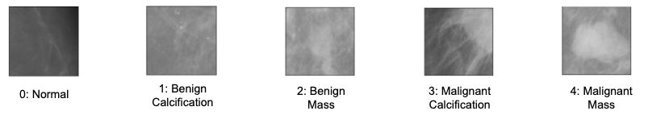

## CS209B Final Project

>Group $17$: David Melancon, Estefania Lahera, Hailey James, Nathan Einstein

## Project Statement

Recent research has demonstrated that computer vision can detect cancer with high accuracy, sometimes with greater accuracy than radiologists. However, there remains significant work to be done to increase interpretability of the models (usually complex convolutional neural networks) used for detection. In this project, we focus on the Curated Breast Imaging Subset of the Digital Database for Screening Mammography (CBIS-DDSM). Classification models are trained on the dataset using transfer learning on the ResNet50 and VGG16 architectures . Once trained, the models are used to investigate the efficiency of different methods of interpretation and explainability including saliency maps, saliency maps through perturbations as well as Shapley and LIME values.

## Project Outline

In the _Introduction_ section we review the literature of cancer diagnosis using CNN while highlighting several methods to interpret and explain the classification of the neural networks. Finally, we discuss the dataset that we are using for this project. Section _EDA_ is the initial exploratory data analysis of the dataset and the _Classification Model_ section details the training, cross-validation, and testing of the different CNN models considered in the project. Section _Pre-Processing Raw Images_ investigates how the models trained on the region of interest ROI of the images can be generalized to train on the full images. Section _Unsupervised Clustering_ attempts to remove noisy images from the dataset (e.g. labels) using autoencoder.
