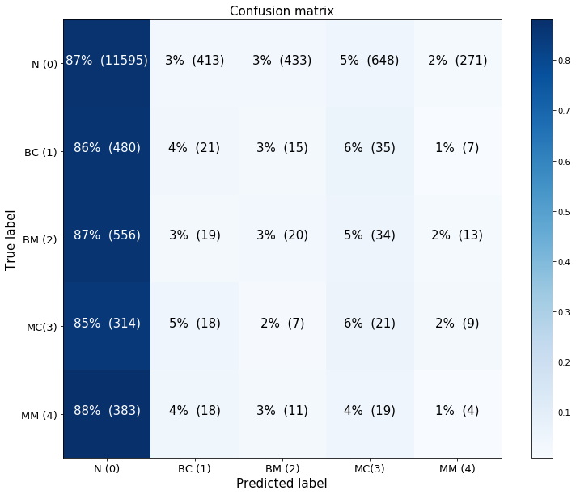
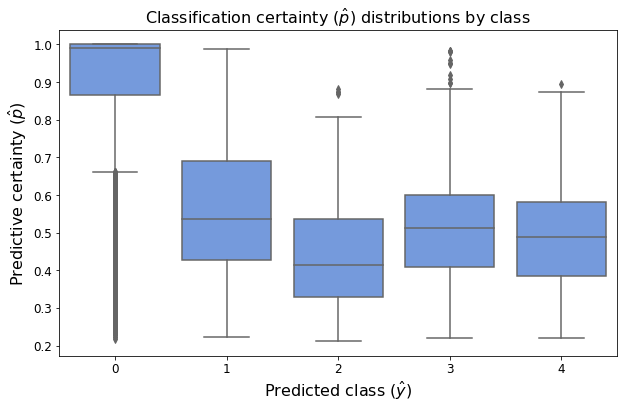
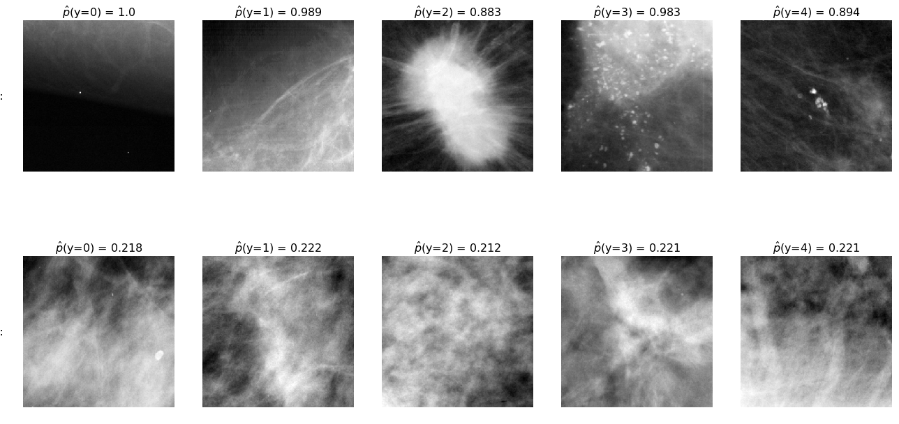
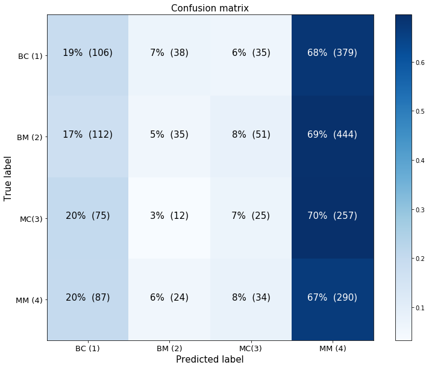
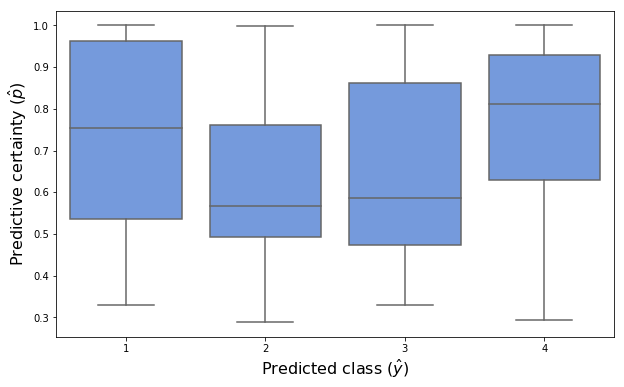
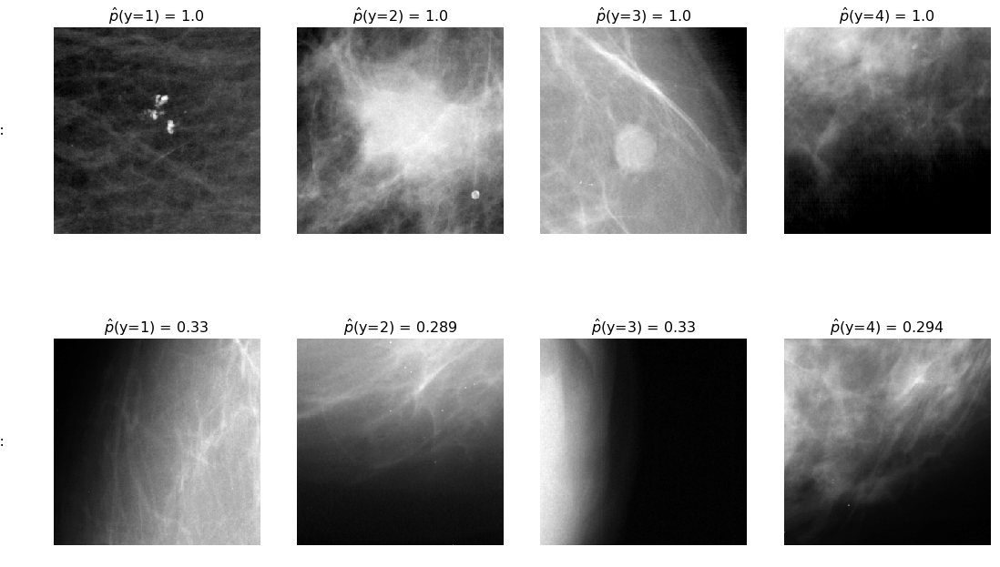

## Contents
{:.no_toc}
*  
{: toc}

```python
'''Build test DataGenerator'''

def get_test_datagen(df, directory='data/test_images/', batch_size_test=1):
    test_datagen = ImageDataGenerator(rescale=1./255)
    test_generator = test_datagen.flow_from_dataframe(
            directory=directory,
            dataframe=df,
            x_col='filename',
            y_col='y',
            target_size=(299, 299),
            color_mode="rgb",
            batch_size=batch_size_test,
            class_mode="categorical",
            shuffle=False,
            seed=42)
    return test_generator
```


```python
# Code source: scikit-learn.org
def plot_confusion_matrix(ax, cm, classes,
                          normalize=False,
                          title='Confusion matrix',
                          cmap=plt.cm.Blues):

    divider = make_axes_locatable(ax)
    cax = divider.append_axes("right", size="5%", pad=0.5)

    cm_original=cm.copy()
    if normalize:
        cm = cm.astype('float') / cm.sum(axis=1)[:, np.newaxis]
    img = ax.imshow(cm, interpolation='nearest', cmap=cmap)
    plt.colorbar(img, ax=ax, cax=cax)
    tick_marks = np.arange(len(classes))
    ax.set(xticks=tick_marks, yticks=tick_marks)
    ax.set_xticklabels(classes, rotation=0, fontsize=13)
    ax.set_yticklabels(classes, fontsize=13)

    fmt = '.2f' if normalize else 'd'
    thresh = cm.max() / 2.
    thresh = 1 / 2.
    for i, j in itertools.product(range(cm.shape[0]), range(cm.shape[1])):
        ax.text(j, i, format(cm[i, j]*100, '.0f') +  '%  (' +format(cm_original[i, j], 'd') + ')',
                 horizontalalignment="center",
                 color="white" if cm[i, j] > thresh else "black", fontsize=15)

    ax.set_title(title, fontsize=15)
    ax.set_ylabel('True label', fontsize=15)
    ax.set_xlabel('Predicted label', fontsize=15)
    ax.grid('off')
```


```python
''' Code for displaying images whose class the predictor was highly certain/uncertain of '''

def show_case_within_p_range(df, pred_class, y_hats, p_hats, thresh_low, thresh_high, ax, directory):
    p_k = np.array([p_hats[i] if (y_hats[i] == pred_class) else 0 for i, p in enumerate(p_hats)])
    
    idx = np.where((p_k <= thresh_high) & (p_k >= thresh_low))[0][0]
    p_val = p_hats[idx]
    file = df.loc[idx, 'filename']
    img = plt.imread(directory + file)
    ax.imshow(img, cmap='gray')
    ax.set_title('$\hat{p}$(y=' + f'{pred_class}) = {p_val:.3}', fontsize=16)
    ax.axis('off')

def show_max_certainty_case(df, pred_class, y_hats, p_hats, ax, directory):
    p_k_max = np.max(p_hats[y_hats == pred_class])
    show_case_within_p_range(df, pred_class, y_hats, p_hats, p_k_max, p_k_max, ax, directory)

def show_min_certainty_case(df, pred_class, y_hats, p_hats, ax, directory):
    p_k_min = np.min(p_hats[y_hats == pred_class])
    show_case_within_p_range(df, pred_class, y_hats, p_hats, p_k_min, p_k_min, ax, directory)
```


### Model 0


```python
test_df_model_0 = pd.read_csv("data/test_df_model_0.csv")
test_df_model_0['y'] = test_df_model_0['y'].astype(str)

model_0 = load_model("models/resnet50_model_0_best_weights.h5")
```


```python
test_generator = get_test_datagen(test_df_model_0)

y_pred_0 = model_0.predict_generator(test_generator, test_generator.n)
p_hat_0 = np.amax(y_pred_0, axis=1)
y_hat_0 = np.argmax(y_pred_0, axis=1)
```


    Found 15364 images belonging to 5 classes.
    


```python
# plot confusion matrix
fig, ax = plt.subplots(figsize=(10,10))
cnf_matrix = confusion_matrix(test_df_model_0['y'].astype(int), y_hat_0)
plot_confusion_matrix(ax, cnf_matrix, classes=['N (0)','BC (1)','BM (2)','MC(3)','MM (4)'], normalize=True)
fig.tight_layout()
```





```python
test_df_model_0['y'].value_counts(normalize=True)
```


    0    0.869565
    2    0.041786
    1    0.036319
    4    0.028313
    3    0.024017
    Name: y, dtype: float64


```python
# plot certainty distribution (p values) for each predicted group
fig, ax = plt.subplots(figsize=(10,6))

sns.boxplot(x='y', y='p', data=pd.DataFrame({"p":p_hat_0, "y":y_hat_0}), ax=ax, color='cornflowerblue')

ax.set_xlabel("Predicted class ($\hat{y}$)", fontsize=16)
ax.set_ylabel('Predictive certainty ($\hat{p}$)', fontsize=16)
ax.tick_params(labelsize=12)
ax.set_title("Classification certainty ($\hat{p}$) distributions by class", fontsize=16);
```





```python
fig, axes = plt.subplots(nrows=2, ncols=5, figsize=(18,10))
for c in range(5):
    show_max_certainty_case(test_df_model_0, c, y_hat_0, p_hat_0, axes[0,c], 'data/test_images/')
    show_min_certainty_case(test_df_model_0, c, y_hat_0, p_hat_0, axes[1,c], 'data/test_images/')
    
for ax, row in zip(axes[:,0], ['high certainty:', 'low certainty:']):
    ax.annotate(row, xy=(0, 0.5), xytext=(-ax.yaxis.labelpad+2, 0),
                xycoords=ax.yaxis.label, textcoords='offset points',
                fontsize=16, ha='right', va='center')

fig.tight_layout()
```





### Model 2


```python
test_df_model_2 = pd.read_csv("data/test_df_model_2.csv")
test_df_model_2['y'] = test_df_model_2['y'].astype(str)

model_2 = load_model("models/resnet50_model_2_best_weights.h5")
```


```python
test_generator = get_test_datagen(test_df_model_2)

y_pred_2 = model_2.predict_generator(test_generator, test_generator.n)
p_hat_2 = np.amax(y_pred_2, axis=1)
y_hat_2 = np.argmax(y_pred_2, axis=1)+1
```


    Found 2004 images belonging to 4 classes.
    


```python
fig, ax = plt.subplots(figsize=(10,10))
cnf_matrix = confusion_matrix(test_df_model_2['y'].astype(int), y_hat_2)
plot_confusion_matrix(ax, cnf_matrix[:-1,1:], classes=['BC (1)','BM (2)','MC(3)','MM (4)'], normalize=True)
fig.tight_layout()
```





```python
# boxplot of certainty distribution (p values) for each predicted group
fig, ax = plt.subplots(figsize=(10,6))
sns.boxplot(x='y', y='p', data=pd.DataFrame({"p":p_hat_2, "y":y_hat_2}), ax=ax, color='cornflowerblue')
ax.set_xlabel("Predicted class ($\hat{y}$)", fontsize=16)
ax.set_ylabel('Predictive certainty ($\hat{p}$)', fontsize=16);
```





```python
fig, axes = plt.subplots(nrows=2, ncols=4, figsize=(15,10))
for i, c in enumerate([1,2,3,4]):
    show_max_certainty_case(test_df_model_2, c, y_hat_2, p_hat_2, axes[0,i], 'data/test_images/')
    show_min_certainty_case(test_df_model_2, c, y_hat_2, p_hat_2, axes[1,i], 'data/test_images/')


for ax, row in zip(axes[:,0], ['high certainty:', 'low certainty:']):
    ax.annotate(row, xy=(0, 0.5), xytext=(-ax.yaxis.labelpad+2, 0),
                xycoords=ax.yaxis.label, textcoords='offset points',
                fontsize=16, ha='right', va='center')

fig.tight_layout()
```





### Test model 0 on full images, masked and unmasked


```python
full_img_df = pd.DataFrame({'subtlety': [5,5,5,5,3,3,3,3], 
                            'y': ['1','2','3','4'] * 2, 
                            'filename': ["calc_full299x299_00344.png", "mass_full299x299_00173.png", 
                                         "calc_full299x299_00390.png", "mass_full299x299_00016.png",
                                         "calc_full299x299_00325.png", "mass_full299x299_00177.png",
                                         "calc_full299x299_00497.png", "mass_full299x299_00324.png"]})

masked_img_df = pd.DataFrame({'y': ['1','2','3','4'] * 2, 
                              'filename': ["calc_299x299_50buf_mask_00344.png", "mass_299x299_50buf_mask_00173.png", 
                                           "calc_299x299_50buf_mask_00390.png", "mass_299x299_50buf_mask_00016.png",
                                           "calc_299x299_50buf_mask_00325.png", "mass_299x299_50buf_mask_00177.png",
                                           "calc_299x299_50buf_mask_00497.png", "mass_299x299_50buf_mask_00324.png"]})

full_img_datagen = get_test_datagen(full_img_df, directory='data/CBIS-DDSM_examples/output_images/')
masked_img_datagen = get_test_datagen(masked_img_df, directory='data/CBIS-DDSM_examples/masked_images/')
```


    Found 8 images belonging to 4 classes.
    Found 8 images belonging to 4 classes.
    


```python
y_pred_full_img = model_0.predict_generator(full_img_datagen, full_img_datagen.n)
p_hat_full_img = np.amax(y_pred_full_img, axis=1)
y_hat_full_img = np.argmax(y_pred_full_img, axis=1)
```


```python
y_pred_masked_img = model_0.predict_generator(masked_img_datagen, masked_img_datagen.n)
p_hat_masked_img = np.amax(y_pred_masked_img, axis=1)
y_hat_masked_img = np.argmax(y_pred_masked_img, axis=1)
```


```python
pd.DataFrame({"True $y$ (complete image)": ['1','2','3','4'] * 2,
              "$\hat{y}$: complete image": y_hat_full_img,
              "$\hat{p}$: complete image": p_hat_full_img,
              "$\hat{y}$: masked image": y_hat_masked_img,
              "$\hat{p}$: masked image": p_hat_masked_img})
```


<div>
<style scoped>
    .dataframe tbody tr th:only-of-type {
        vertical-align: middle;
    }

    .dataframe tbody tr th {
        vertical-align: top;
    }

    .dataframe thead th {
        text-align: right;
    }
</style>
<table border="1" class="dataframe">
  <thead>
    <tr style="text-align: right;">
      <th></th>
      <th>True $y$ (complete image)</th>
      <th>$\hat{y}$: complete image</th>
      <th>$\hat{p}$: complete image</th>
      <th>$\hat{y}$: masked image</th>
      <th>$\hat{p}$: masked image</th>
    </tr>
  </thead>
  <tbody>
    <tr>
      <th>0</th>
      <td>1</td>
      <td>4</td>
      <td>0.688789</td>
      <td>4</td>
      <td>0.708869</td>
    </tr>
    <tr>
      <th>1</th>
      <td>2</td>
      <td>4</td>
      <td>0.712141</td>
      <td>4</td>
      <td>0.568441</td>
    </tr>
    <tr>
      <th>2</th>
      <td>3</td>
      <td>4</td>
      <td>0.641636</td>
      <td>4</td>
      <td>0.650779</td>
    </tr>
    <tr>
      <th>3</th>
      <td>4</td>
      <td>1</td>
      <td>0.265910</td>
      <td>0</td>
      <td>0.741181</td>
    </tr>
    <tr>
      <th>4</th>
      <td>1</td>
      <td>4</td>
      <td>0.515154</td>
      <td>4</td>
      <td>0.480932</td>
    </tr>
    <tr>
      <th>5</th>
      <td>2</td>
      <td>4</td>
      <td>0.484582</td>
      <td>4</td>
      <td>0.479284</td>
    </tr>
    <tr>
      <th>6</th>
      <td>3</td>
      <td>4</td>
      <td>0.459287</td>
      <td>0</td>
      <td>0.469885</td>
    </tr>
    <tr>
      <th>7</th>
      <td>4</td>
      <td>0</td>
      <td>0.393802</td>
      <td>0</td>
      <td>0.493522</td>
    </tr>
  </tbody>
</table>
</div>


The classifier performed poorly on identifying the particular type and malignancy of the abnormalities in the complete images, though the results on first appearance suggest that the classifier at least identified the presence of an abnormality in the complete images (with the one exception of the final image in which the model egregiously misclassifies an image with a malignant mass as lacking any sort of suspicious abnormality). 

However, even after occluding the region of interest, the classifier continued to identify most of the images as containing a mass, revealing that it would be incorrect to conclude that the classifier had accurately identified the presence of an abnormality in the images. It is possible that there were additional features (e.g. smaller growths) in the image that were not occluded, but which revealed the images to contain an abnormality. To test this, we would have wished to create saliency maps for these images, both with and without the occluded regions of interest. Unfortunately, time did not permit us to do so.
